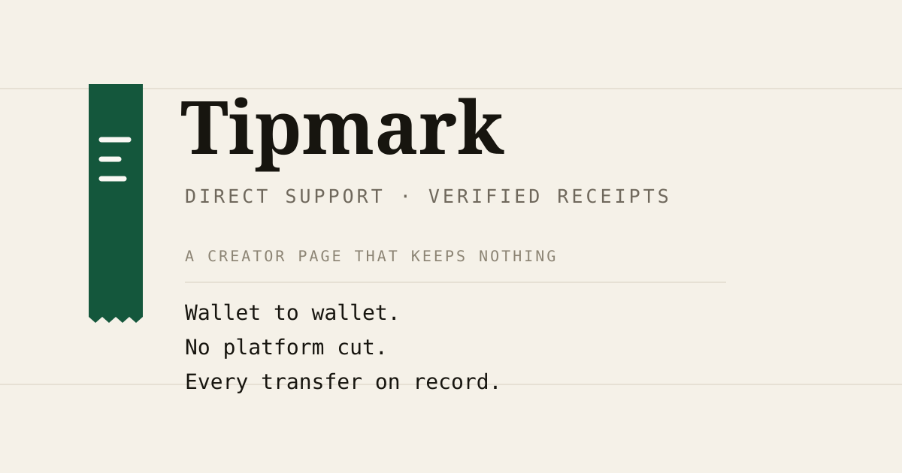

# Tipmark


Tipmark is a non-custodial creator support page for Solana. A creator claims a
link, shares it, and supporters send SOL straight from their wallet to the
creator's. There is no platform cut or custody, and every contribution has a
verifiable receipt.

There is no database, no login, and no upload provider. Ownership lives in a
Solana program, profile content lives permanently on Arweave, and the connected
wallet is the only identity. Delete the deployment and every page, payout
route, and receipt is still intact and still verifiable.

> **Devnet only.** The protocol currently targets Solana Devnet for testing.
> Do not use mainnet funds with this application.

<p align="center">
  
</p>

## 📋 Table of Contents

- [Overview](#overview)
- [Design](#design)
- [Tech Stack](#tech-stack)
- [Key Features](#key-features)
- [Getting Started](#getting-started)
  - [Prerequisites](#prerequisites)
  - [Installation](#installation)
  - [Environment Variables](#environment-variables)
- [Usage](#usage)
- [Project Structure](#project-structure)
- [Contributing](#contributing)
- [License](#license)
- [Acknowledgments](#acknowledgments)

## 🌟 Overview

Tipmark bridges the gap between content creators and their supporters in the
Web3 ecosystem. Creators build a personal page with a unique handle, share it,
receive SOL directly to their own wallet, and track every contribution in a
ledger where each row links to the transaction on-chain.

## 🎨 Design

The interface is built around one idea — **a tip jar that prints receipts**.
Money moves wallet-to-wallet and the chain keeps the record, so the UI is
stationery, not a trading terminal: warm paper, hairline rules, tabular
figures, and a single engraved-green spot colour that only ever means "money".

Three typographic voices each do one job:

- **Newsreader** (serif) — the person: names, headlines, editorial copy.
- **Geist Mono** — the machine: amounts, addresses, signatures, field labels.
- **Geist Sans** — the interface: buttons, inputs, navigation.

The design system lives in `app/globals.css` (tokens, utilities, the whole
motion budget) and `components/ui/*` (primitives). The recurring structural
element is the **ledger row** — a label/value line separated by a hairline —
which appears on the support panel, the receipt, and the dashboard.

## 🛠️ Tech Stack

- **Framework**: Next.js 15 (App Router) · React 18 · TypeScript
- **Styling**: Tailwind CSS v4 (CSS-first `@theme`) + `tw-animate-css`
- **UI primitives**: Radix (dialog, dropdown, checkbox, label) + custom system
- **Fonts**: Geist Sans, Geist Mono, Newsreader (`next/font/local`)
- **Identity**: the connected Solana wallet — no accounts, no sessions
- **State**: Solana program accounts, plus Arweave for profile metadata
- **Blockchain**: Solana Web3.js + Kit + Solana Wallet Adapter
- **Uploads**: Arweave via Irys, signed by the creator's wallet
- **QR**: `qrcode.react` · **Export**: `html2canvas`
- **Deployment**: Vercel

## ✨ Key Features

- **Zero platform fee**: direct wallet-to-wallet transfers, non-custodial
- **No database**: every screen is read from Solana and permanent storage
- **Personal pages**: a claimable `tipmark.xyz/<handle>` letterhead
- **Multi-wallet**: connect any Solana wallet, with an explainer for newcomers
- **Verifiable receipts**: every contribution is rebuilt from its transaction
- **Creator ledger**: real transaction table, 12-month history, live USD
- **Share card**: a downloadable PNG with a scannable QR
- **Responsive & accessible**: single design language across every screen

## 🚀 Getting Started

### Prerequisites

- Node.js (v18 or higher)
- Bun or npm
- A Solana wallet with Devnet SOL

### Installation

1. Clone the repository:
   ```bash
   git clone https://github.com/yourusername/tipmark.git
   cd tipmark
   ```

2. Install dependencies:
   ```bash
   bun install
   # or
   npm install
   ```

3. Copy the environment template and point it at your deployment:
   ```bash
   cp .env.example .env
   ```

4. Start the development server:
   ```bash
   bun run dev
   # or
   npm run dev
   ```

There is no database to provision and no migration to run. The app reads
Solana and Arweave directly.

### Environment Variables

Copy `.env.example` to `.env` and fill it in. **Every variable is public.** The
deployment holds no secrets: there is no database password, no OAuth secret, and
no API key, because there is no server-side state and no third-party account.

| Variable | Required | Source |
| --- | --- | --- |
| `NEXT_PUBLIC_SOLANA_CLUSTER` | Yes | Set to `devnet`. Only `devnet` and `localnet` are accepted; anything else is rejected. |
| `NEXT_PUBLIC_TIPMARK_PROGRAM_ID` | Yes | The program address from the Anchor deployment. It must match `Anchor.toml` and the generated IDL, and its config PDA must already be initialized. |
| `NEXT_PUBLIC_SOLANA_RPC_URL` | Yes | A Devnet HTTPS endpoint from Helius, QuickNode, Triton, Alchemy, or another provider. Prefer a domain-restricted key: this URL is served to the browser. |
| `NEXT_PUBLIC_SOLANA_RPC_URLS` | Recommended | Additional same-cluster HTTPS endpoints, comma-separated, for server read failover. |
| `NEXT_PUBLIC_SOLANA_WS_URL` | Recommended | The matching WebSocket endpoint from the same provider. |
| `NEXT_PUBLIC_BRAND_DOMAIN` | Recommended | The domain you control, without `https://`. Used for canonical links and share cards. |
| `NEXT_PUBLIC_ARWEAVE_GATEWAY_URLS` | Optional | Arweave/Irys gateways, comma-separated. Defaults are in `.env.example`. |
| `NEXT_PUBLIC_IPFS_GATEWAY_URLS` | Optional | IPFS gateways, comma-separated. Defaults are in `.env.example`. |

Profile text and images are published from the creator's wallet to Arweave
through Irys, so there is no upload provider to configure. The wallet signs and
funds its own permanent uploads.

Redeploy after changing any `NEXT_PUBLIC_*` value — they are read at build time.

### Release and governance variables

These are consumed by `bun run protocol:release-check`, never by the running
app. All of them are public addresses or published governance metadata; never
supply a private key.

| Variable | Purpose |
| --- | --- |
| `TIPMARK_RELEASE_CLUSTER` | Must be `devnet` for the release checker. |
| `TIPMARK_PROGRAM_ADDRESS` | Program address being released. |
| `TIPMARK_UPGRADE_AUTHORITY` | Public upgrade-authority address. |
| `TIPMARK_MULTISIG_ADDRESS` | Public governance multisig address. |
| `TIPMARK_MULTISIG_THRESHOLD` | Required approval count, at least 2. |
| `TIPMARK_MULTISIG_SIGNERS` | Comma-separated public signer addresses. |

## 💻 Usage

1. **Claim a handle**:
   Connect a Solana wallet and pick your link. The wallet owns the page; there
   is no account to create and no password to lose.

2. **Publish your profile**:
   Add a name, bio, images, and the wallet you want to be paid in. Your wallet
   signs the transaction and funds the permanent Arweave upload.

3. **Share your link**:
   Use `tipmark.xyz/yourhandle` to receive contributions.

4. **Track contributions**:
   The ledger recomputes your totals from verified on-chain tips each time you
   open it.

## 📂 Project Structure

```
tipmark/
├── actions/         # Server actions: chain reads, no writes
├── app/             # Next.js app directory with routes
├── clients/         # Generated type-safe protocol client
├── components/      # Reusable UI components
├── idls/            # Committed program IDL
├── lib/protocol/    # PDAs, metadata, receipts, earnings, uploads
├── programs/        # The Anchor program (Rust)
├── public/          # Static assets
├── scripts/         # Build, codegen, localnet smoke, release checks
└── ...
```

## 👥 Contributing

We welcome contributions to Tipmark! Please follow these steps:

1. Fork the repository
2. Create a new branch (`git checkout -b feature/amazing-feature`)
3. Make your changes
4. Commit your changes (`git commit -m 'Add some amazing feature'`)
5. Push to the branch (`git push origin feature/amazing-feature`)
6. Open a Pull Request


## 📜 License

This project is licensed under the MIT License - see the [LICENSE](LICENSE) file for details.

## 🙏 Acknowledgments

- The Solana ecosystem for providing the tools and infrastructure
- All open-source projects that made this possible
- Our early adopters and community members

---

<p align="center">
  <a href="https://tipmark.xyz">Visit Tipmark</a>
</p>
